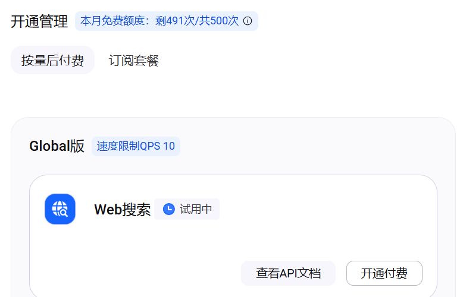
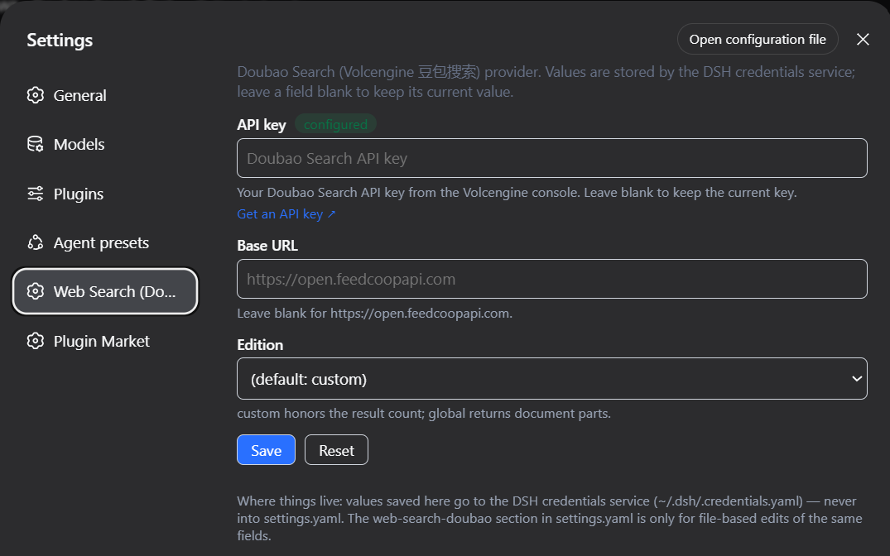

# dsh-web-search-doubao

**Web search for the DeepSeek Harness, powered by Doubao Search (Volcengine 豆包搜索).**

[](https://github.com/kenny2077/dsh-web-search-doubao/actions/workflows/ci.yml)
[](https://www.npmjs.com/package/dsh-web-search-doubao)
[](LICENSE)

English | [中文](README.zh.md)

## What is it

`dsh-web-search-doubao` is a community plugin for the [DeepSeek Harness](https://github.com/deepseek-ai/deepseek-harness) that plugs a [Doubao Search](https://www.volcengine.com/docs/82379/2309827)-backed search provider into the harness's [`ctx.web` capability seam](https://github.com/deepseek-ai/deepseek-harness/blob/main/packages/web/web/README.md). One `dsh plugin add` and your harness searches the web through ByteDance's standalone Doubao Search API — no editing of base bundles, no restart to change settings.

This is **not** the Ark chat-side 联网内容插件: nothing here routes through a Doubao chat model. It uses the standalone Doubao Search service, so search is decoupled from model inference entirely.

> Prefer Zhipu/GLM? This plugin has a sibling: [dsh-web-search-zai](https://github.com/kenny2077/dsh-web-search-zai) — the same provider pattern for ZAI's standalone Web Search API, sharing one design language.

## Why

- **Separate billing from your model spend.** Doubao Search is its own service with its own key: **500 free searches per month**, then pay-per-use (or a monthly package on the `custom` edition). No model tokens are consumed by a search — costs never blur into your Ark/LLM invoice.
- **ByteDance ecosystem sources.** The backend draws on the same index that powers Doubao app search, including Toutiao/Douyin-ecosystem public content — strong coverage of the Chinese web, with publish times down to the second when a source provides one.
- **Runtime-configurable.** Edition, endpoint, snippet length, and authority filter are plain settings — a committed change takes effect on the very next search, no restart.
- **Fits the seam, not around it.** The provider registers into `ctx.web` exactly like the built-in DeepSeek provider, so [`dsh-tool-web`](https://github.com/deepseek-ai/deepseek-harness/blob/main/packages/web/tool-web/README.md) and everything above the seam work unchanged.
- **No invented fields.** Only what the API actually returns gets mapped — `publishedAt` appears only when the source provides one.

## How it works

**The search path** — the provider registers into `ctx.web` exactly like the built-in DeepSeek provider, so `dsh-tool-web` and everything above the seam work unchanged:

```
┌────────────────────────────────────────────────┐
│                DeepSeek Harness                │
│                                                │
│  model ──▶ web_search tool ──▶ ctx.web seam    │
└───────────────────────────────────────────┬────┘
                                            │
                                            ▼
                            ┌──────────────────────────────┐
DOUBAO_SEARCH_API_KEY ─────▶│      web-search-doubao       │
 (credentials store —       │        (this plugin)         │
  resolved per search)      └───────────────┬──────────────┘
                                            │  POST {baseURL}/search_api/web_search
                                            ▼        or /search_api/global_search
                            ┌──────────────────────────────┐
                            │  Doubao Search (Volcengine   │
                            │          豆包搜索)            │
                            └───────────────┬──────────────┘
                                            │  Result.WebResults[] / Documents[]
                                            ▼
                              normalized WebSearchResult
                              (sources + truncated, with
                               publishedAt when provided)
                            ──▶ back to your model, unchanged
```

**The settings path** — this is what sets the plugin apart: a dedicated card in the harness Settings GUI, storing values in the credentials service so no secret ever reaches a settings file:

```
┌────────────────────────────────────────────────────┐
│   Settings GUI ─ "Web Search (Doubao)" card        │
│   key (masked, "Get an API key ↗" console link)    │
│   base URL · edition · configured badge            │
└───────────────────────┬────────────────────────────┘
                        │  Save / Reset
                        ▼
        ┌────────────────────────────────────┐
        │  DSH credentials service           │
        │  ~/.dsh/.credentials.yaml          │
        │   DOUBAO_SEARCH_API_KEY            │
        │   DOUBAO_SEARCH_BASE_URL           │
        │   DOUBAO_SEARCH_EDITION            │
        └────────────────────┬───────────────┘
                             │  re-resolved on every search —
                             ▼  next search, no restart
                      the search path above
```

The service ships two editions with different wire formats; `edition` picks one:

**`custom`** (default — honors the result count server-side)

| Doubao field | Seam field | Notes |
|---|---|---|
| `Url` | `url` | Entry dropped if missing |
| `Title` | `title` | Omitted when empty |
| `Content` ‖ `Summary` ‖ `Snippet` | `snippet` | First non-blank wins; entry dropped if all blank |
| `PublishTime` | `publishedAt` | Omitted when the source provides none |
| `SiteName`, `AuthInfoDes` | — | Not mapped |

**`global`** (longer document bodies, structured `Parts[]`)

| Doubao field | Seam field | Notes |
|---|---|---|
| `Url` | `url` | Entry dropped if missing |
| `Title` | `title` | Omitted when empty |
| `Parts[]` (`Type: "text"`) | `snippet` | Text parts joined; entry dropped if none |
| `DocumentInfo.PublishTime` | `publishedAt` | Omitted when absent |
| `HostInfo`, `ContentTokenCount`, image parts | — | Not mapped; images are never requested |

Failures surface as standard `WebError` codes: `WEB_PROVIDER_ERROR` (HTTP/network/bad body), `WEB_ABORTED` (cancellation), and `WEB_PROVIDER_CREDENTIAL_MISSING` (no key). Through `dsh-tool-web`, these reach the model under the consumer's usual error wrapper.

## Quick start

You'll need the [DeepSeek Harness](https://github.com/deepseek-ai/deepseek-harness) installed (`dsh` CLI available) and a Doubao Search API key.

1. **Get a key** at the [Doubao Search API-key page](https://console.volcengine.com/search-infinity/api-key): sign in with your Volcengine account, 开通服务 (activate the service), then 创建 API Key. The key is **separate from any `ARK_API_KEY`** — it authorizes only the Doubao Search service. Every account gets 500 free searches per month; beyond that you enable pay-per-use in the same console.

   > This is *not* the 火山方舟 (Ark) console key. The Ark chat-side web-search plugin is a different product with different billing.

   

   Store the key so it never lands in a config file — paste it into the plugin's **Web Search (Doubao)** settings card in the harness GUI (see [below](#settings-gui-card)), add a `DOUBAO_SEARCH_API_KEY` entry to `$DSH_HOME/.credentials.yaml`, or export it in the launching environment.

2. **Install the plugin:**

   ```sh
   dsh plugin add dsh-web-search-doubao        # from npm
   dsh plugin add github:kenny2077/dsh-web-search-doubao   # from git (prebuilt, no build step)
   ```

   The `cordis.patch.yml` overlay registers the provider and switches the active `searchProvider` from `deepseek-official` to `doubao` in one step. To go back: `dsh plugin remove dsh-web-search-doubao`.

3. **Search.** Ask your harness something current and watch the `web_search` tool return Doubao results.

## Settings GUI card



After install, the harness settings sidebar gains a **Web Search (Doubao)** section with three fields — API key (masked input, with a clickable **Get an API key ↗** link to the [Doubao Search API-key page](https://console.volcengine.com/search-infinity/api-key)), Base URL, and Edition. **Save** writes them to the DSH credentials service (under the `DOUBAO_SEARCH_API_KEY`, `DOUBAO_SEARCH_BASE_URL`, and `DOUBAO_SEARCH_EDITION` references); **Reset** clears all three. The badge next to the API key flips to *configured* once a key is stored and refreshes live when the key changes. Saved values take effect on the next search — no restart.

A footer in the card maps where things live, so you never have to guess: card values → `~/.dsh/.credentials.yaml` (the credentials service), **never** `settings.yaml`; the `web-search-doubao` section in `settings.yaml` exists only for file-based edits of the same fields.

Because the card stores values as credential references, they override the settings-file fields and environment variables:

| Precedence | Source |
|---|---|
| 1 | Credentials service (what the card writes) |
| 2 | `web-search-doubao` settings (`apiKey`, `baseURL`, `edition`) |
| 3 | Environment (`DOUBAO_SEARCH_API_KEY`, `DOUBAO_SEARCH_BASE_URL`) |
| 4 | Built-in defaults |

`maxSnippetLength` and `authLevel` remain config-file-only (rarely tuned). The card itself is built from a reusable, config-driven factory (`src/client/card.tsx`) — future search-key providers (ZAI, Kimi, Qwen, …) can instantiate the same component with their own references and dictionaries.

## Configuration

All fields are runtime-configurable via the settings GUI (`web-search-doubao` namespace); changes apply on the next search. Values stored by the **Web Search (Doubao)** settings card (credential references) win over every field below — see [Settings GUI card](#settings-gui-card).

| Key | Default | Meaning |
|---|---|---|
| `apiKey` | (from credentials store) | Literal Doubao Search API key. Prefer `apiKeyEnv` so no secret enters config files. |
| `apiKeyEnv` | `DOUBAO_SEARCH_API_KEY` | Credential reference resolved for each search. |
| `baseURL` | `https://open.feedcoopapi.com` | Endpoint base; the edition appends `/search_api/web_search` or `/search_api/global_search`. |
| `edition` | `custom` | `custom` honors the requested result count; `global` returns longer document bodies. |
| `maxSnippetLength` | (unset) | `global` edition only: maximum characters per document body snippet (`max_snippet_length`). |
| `authLevel` | (unset) | `custom` edition only: source-authority floor 1–4 (`Filter.AuthInfoLevel`; 1 = government/top institutions). |

## Known limitations

- Results without a URL or body text are dropped, so you may get fewer sources than requested.
- The `global` edition may return ~10 documents regardless of the requested count (server-side cap); the `custom` edition honors `Count`. Either way the seam enforces `maxResults` on return.
- No recency filter — the API has no documented server-side recency parameter.
- `publishedAt` appears only when the upstream source provides a publish time.
- Images are never requested (`max_image_count_per_doc` is left unset); the seam has no image field.
- Only a `DOMException` named `AbortError` maps to `WEB_ABORTED`; aborts carrying custom reasons surface as `WEB_PROVIDER_ERROR`.
- The chat-side 联网内容插件 variant (Ark `web_search` tool / Bot endpoints) is not implemented; this provider uses the standalone search API only.

## Repository architecture

One package, two halves: the **node half** speaks to the `ctx.web` seam; the **client half** renders the settings card in the harness GUI. They meet only at the credentials service.

```
dsh-web-search-doubao/
├── src/                          # ── published source ──
│   ├── index.ts                  #     node entry: Config schema, settings section,
│   │                             #       credential-chain resolution, apply()
│   ├── provider.ts               #     DoubaoSearchProvider: per-search option snapshot
│   │                             #       + credential overrides, both editions'
│   │                             #       request/response mapping, WebError discipline
│   ├── types.ts                  #     wire types for the two Doubao Search editions
│   ├── invariant.ts              #     package-owned invariant companion (no-op)
│   └── client/                   # ── the settings-card half (browser bundle) ──
│       ├── card.tsx              #     createSearchProviderCard(): the reusable,
│       │                         #       provider-agnostic card factory
│       └── index.tsx             #     the Doubao instantiation: credential refs,
│                                 #       console link, en/zh copy
├── tests/
│   ├── doubao.spec.ts            #     node suite: mapping, requests, errors,
│   │                             #       registration, credential precedence
│   ├── doubao.e2e.ts             #     live-API smoke (self-skips without a key)
│   └── client-card.spec.ts       #     card suite: save/reset/badge flows on a fake
│                                 #       context + the built bundle's ModuleLoader handoff
├── lib/                          # ── build output (committed: git installs need no build) ──
│   ├── index.js                  #     node entry (ESM, tsc)
│   ├── client.js                 #     settings card (browser bundle, tsdown) wrapped for
│   │                             #       the shell's window.__ModuleLoader__
│   └── types/                    #     type declarations
├── cordis.patch.yml              # install overlay: registers the provider and selects
│                                 #   searchProvider: doubao in one `dsh plugin add`
├── tsconfig.json                 # strict TS, ES2024 ESM, react-jsx for the client half
├── tsdown.config.ts              # client build recipe (ModuleLoader wrapper, react external)
├── vitest.config.ts
└── .github/workflows/ci.yml      # typecheck + build + test on node 22/24 × Linux/Windows
```

## Development

```sh
pnpm install     # all dependencies (including DSH seam packages) come from npm
pnpm typecheck   # tsc --noEmit
pnpm build       # emits lib/*.js + lib/types/*.d.ts + the wrapped lib/client.js settings card
pnpm test        # unit suite
```

The live-API smoke test self-skips without a key:

```sh
DOUBAO_SEARCH_API_KEY=<key> pnpm exec vitest run tests/doubao.e2e.ts
```

See [CONTRIBUTING.md](CONTRIBUTING.md) for guidelines.

## License

[MIT](LICENSE)
